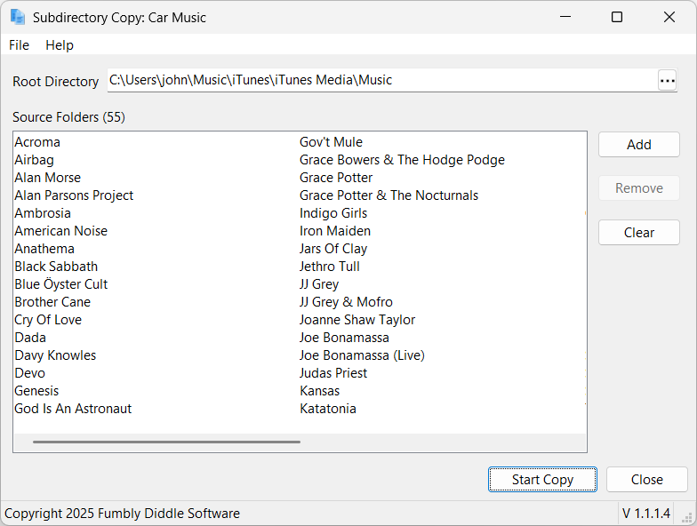
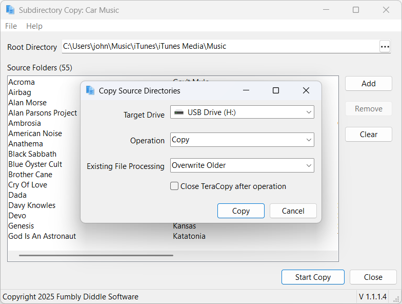
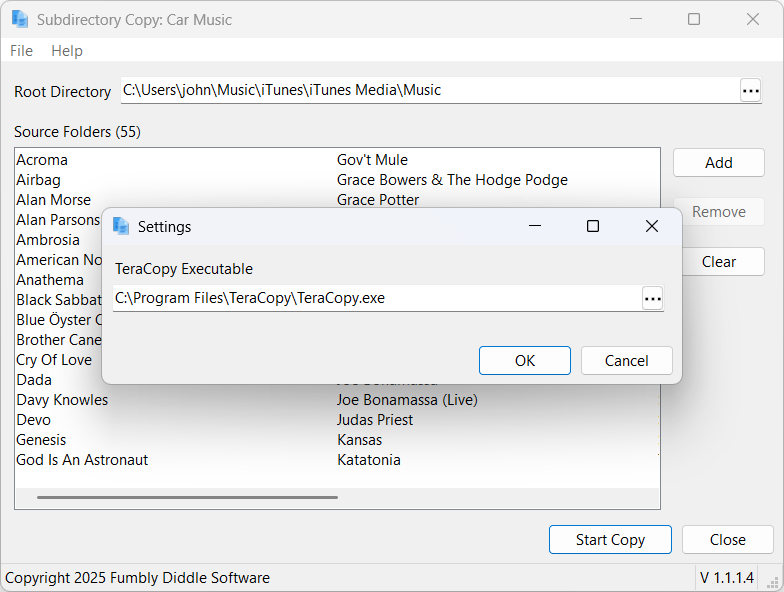

# Subdirectory Copy

## Open Tasks

- [ ] Video recording
- [ ] Publish v1.1 binary
- [ ] Publish static site update
- [ ] Publish docs update
- [ ] Blog post
- [ ] Refactor app to use RzRegApp for all Registry interaction
- [ ] Block secondary instances from running

## Introduction

Have you ever needed to copy a subset of a directory's subdirectories to a flash drive? This application allows you to do that. 

For example, some automobiles allow drivers to insert SD cards or attach USB Flash drives to vehicle and play music from the attached drive. If your music catalog is too large to fit on the drive (or if the vehicle only supports a maximum size drive) then you may need to copy just a subset of the artists to the device.

In the application, specify the root directory that contains the subdirectories you want to copy. Next, drag and drop the subdirectories you want copied. 

Once populated, click the **Start Copy** button on the toolbar to start the copy process.

The application uses Code Sector's [TeraCopy for Windows](https://www.codesector.com/teracopy) to copy the subdirectories. You must have TeraCopy installed to use the application.

